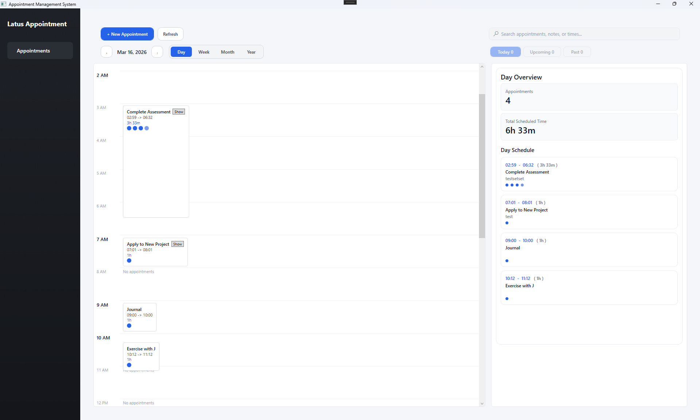
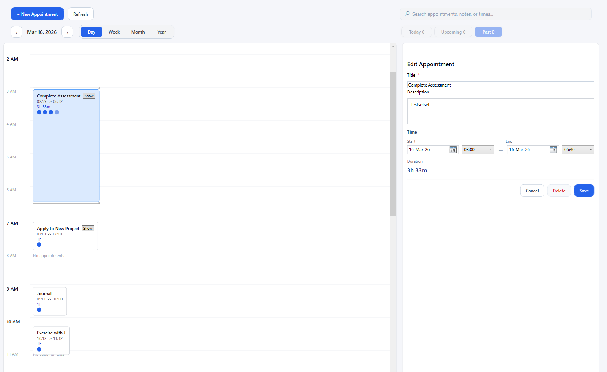
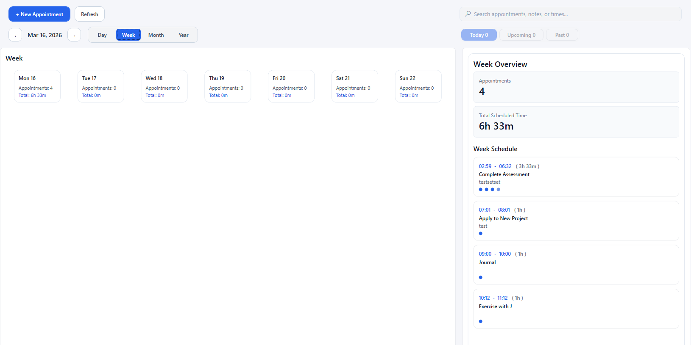
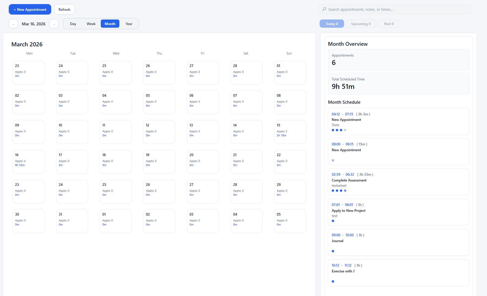
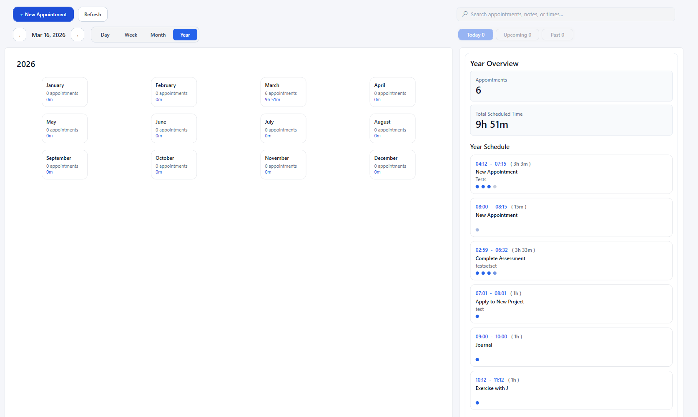
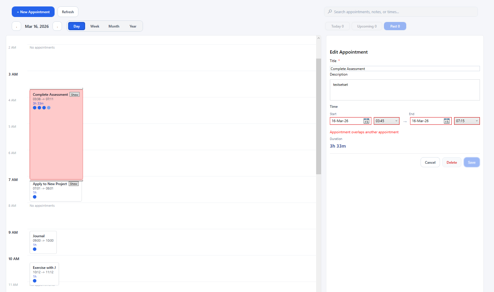
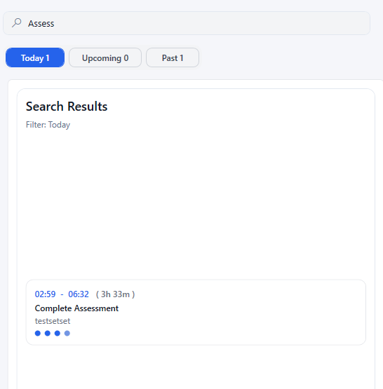

# Appointment Management System

## Author

**Arvin Jayson Castro**  
Senior Full-Stack Engineer  

🌐 https://arvinjaysoncastro.com  
💼 https://linkedin.com/in/arvinjaysoncastro  

---

# Overview

The **Appointment Management System** is a scheduling platform prototype built to demonstrate **Clean Architecture, MVVM design patterns, and scalable UI architecture in .NET**.

The application allows users to create, edit, search, and manage appointments using multiple calendar perspectives while enforcing scheduling constraints such as **overlap detection and timeline consistency**.

The project focuses on **architectural clarity and maintainability**, demonstrating how complex UI-driven systems should be structured to separate domain logic from presentation logic.

This repository is designed as a **portfolio-quality architecture example**, not just a functional prototype.

---

# Key Features

### Multi-Perspective Calendar Views

The system supports multiple scheduling perspectives to improve usability and data visibility.

- Day Timeline Scheduling
- Week Overview
- Month Calendar
- Year Planning

### Interactive Timeline Scheduling

Appointments are rendered on a timeline where they can be:

- Dragged
- Resized
- Repositioned

The system dynamically recalculates layout and durations.

### Conflict Detection

The scheduling engine prevents invalid scheduling by detecting overlapping appointments.

Conflicts are highlighted visually and validated before saving.

### Appointment Editing

Users can modify appointment data through a dedicated editor panel.

- title
- description
- start and end time
- automatic duration calculation

### Search and Filtering

The system supports quick filtering of appointments based on:

- keyword search
- upcoming appointments
- past appointments
- today's appointments

---

# Application Screenshots

## Day Timeline View

The day timeline provides precise control of appointment scheduling with drag-based layout.

---

## Appointment Editor

The editor panel allows users to modify appointment metadata and scheduling information.

---

## Week Overview

The week dashboard summarizes scheduled workload across multiple days.

---

## Month Calendar

The month view provides a grid overview of appointment distribution.

---

## Year Overview

The year planner aggregates appointment activity across months.

---

## Conflict Detection

The system prevents overlapping appointments and highlights scheduling conflicts.

---

## Search Results

Search allows quick retrieval of appointments based on keywords and filters.

---

# Architecture

The solution follows **Clean Architecture principles**.

Presentation (WPF UI)
↓
Application Layer
↓
Domain Layer
↑
Infrastructure

### Dependency Direction

UI → Application → Domain
Infrastructure → Application → Domain

The **Domain layer has zero dependencies**, ensuring business rules remain independent from frameworks and external services.

---

# Architectural Principles

### Separation of Concerns

Business logic is isolated from presentation logic.

### Dependency Rule

Source code dependencies can only point inward.

### Stateless Services

Core scheduling functionality is implemented using stateless services.

### ViewModel Delegation

ViewModels orchestrate UI state but delegate complex logic to services.

---

# Core System Components

## TimelineLayoutService

Responsible for:

- generating timeline hour blocks
- assigning appointments to visual slots
- computing layout dimensions
- handling drag and resize calculations

---

## DraftValidationService

Handles validation logic including:

- appointment validation
- overlap detection
- validation rule mapping
- UI error integration

---

## AppointmentFilterService

Encapsulates filtering and search functionality:

- dashboard filtering
- keyword search
- appointment grouping
- result aggregation

---

## CalendarSummaryService

Generates scheduling summaries used by dashboards:

- daily summaries
- weekly summaries
- monthly summaries
- yearly summaries

---

# Technology Stack

| Layer | Technology |
|------|-----------|
| UI | WPF |
| Language | C# |
| Framework | .NET |
| Architecture | Clean Architecture |
| UI Pattern | MVVM |
| Dependency Injection | Microsoft.Extensions.DependencyInjection |

---

# Project Structure

src/
├── AppointmentManagementSystem.Domain
│ ├── Entities
│ ├── Events
│ ├── Exceptions
│ └── Interfaces
│
├── AppointmentManagementSystem.Application
│ ├── Services
│ ├── DTOs
│ └── Use Cases
│
├── AppointmentManagementSystem.Infrastructure
│ ├── Repositories
│ └── API Integrations
│
└── AppointmentManagementSystem.WpfClient
├── Models
├── Services
├── ViewModels
└── Views

---

# Engineering Objectives

This project demonstrates:

- maintainable UI architecture
- scalable domain modeling
- clean dependency boundaries
- real-world scheduling logic
- structured service delegation

The system architecture is intentionally designed to scale toward:

- enterprise scheduling platforms
- resource planning systems
- distributed calendar systems

---

# Future Enhancements

Potential next steps include:

- persistent database storage
- REST API integration
- multi-user scheduling
- real-time updates
- automated unit tests
- audit history for scheduling changes

---

# License

MIT License

---

# Final Note

This repository showcases **architectural thinking and system design**, emphasizing how complex UI-driven business applications can remain maintainable through proper layering and separation of responsibilities.

The goal is to demonstrate **production-quality engineering practices**, not just feature implementation.